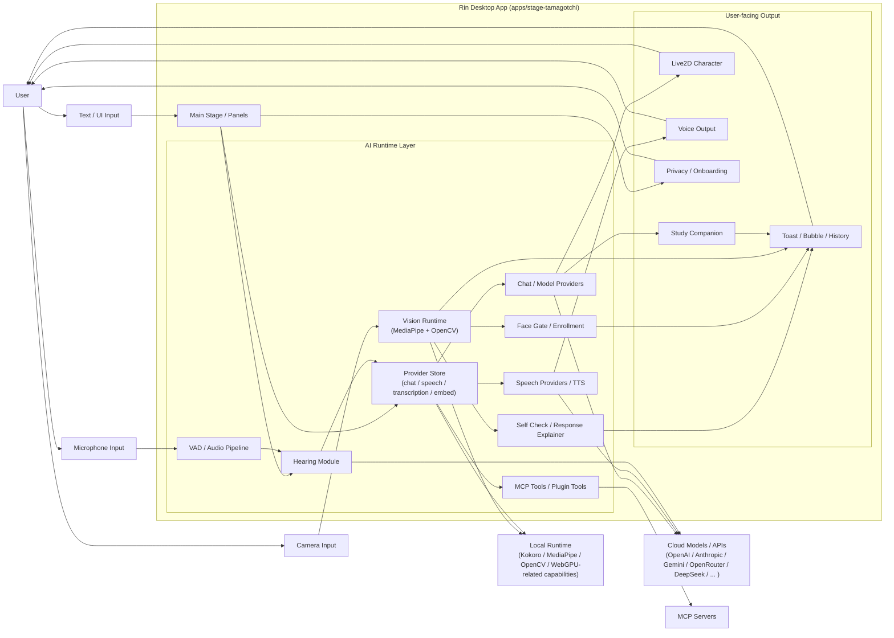

# Rin

> 面向学习陪伴与本地视觉互动的低打扰桌面伙伴

Rin 是一个基于 Project AIRI 深度改造的桌面 AI 伙伴项目。它保留了 AIRI 原有的多 Provider / 多模型 AI 底座、语音与工具扩展能力，同时围绕桌面低打扰交互、学习陪伴、本地视觉互动和隐私可信设计进行了系统重构。

当前项目重点落在 5 条主线：

- AI 伙伴底座：LLM、语音、工具与扩展能力
- 低打扰桌面存在：长期悬浮，但不遮挡主任务
- 学习陪伴闭环：任务、专注、提醒、统计、导出
- 本地视觉互动：自检、解释、录入、门控、反馈历史
- 隐私可信设计：本地优先、边界清晰、保守表述

本仓库仍保留 AIRI 的 monorepo 工程基础，而 Rin 当前最核心的产品实现主要集中在桌面应用 `apps/stage-tamagotchi`。

## 项目定位

Rin 不是“会动的桌宠截图”，而是一套围绕 HCI 原则改造过的桌面陪伴原型：

- 对 AI 能力更完整：保留多模型、多语音、多工具扩展的 AIRI 底座
- 对用户主任务低干扰：角色靠近淡出、点击穿透、控件保护区
- 对新手可理解：首次启动引导、可见入口、自然语言状态说明
- 对熟练用户高效率：快捷键、托盘菜单、Move Mode、Fit Mode
- 对高敏感能力更可信：摄像头用途可见、人脸档案本地加密、反馈可解释

## AI 能力重点

Rin 当前仓库中仍然保留并可扩展 AIRI 的 AI 主能力栈，主要包括以下几类：

| AI 能力 | 当前实现 | 相关代码 |
| --- | --- | --- |
| 多 LLM Provider / 多模型接入 | 统一 Provider Store，支持 chat / speech / transcription / embedding 等类型 Provider；已包含 OpenAI、Anthropic、Google Gemini、OpenRouter、Ollama、DeepSeek、Azure OpenAI、OpenAI-compatible 等接入定义 | `packages/stage-ui/src/stores/providers.ts` |
| 模型与语音配置 | Provider 能力支持列出 models、voices、配置 onboarding 字段与连通性校验 | `packages/stage-ui/src/stores/providers.ts` |
| 语音识别与语音合成 | 保留 transcription / speech provider 能力，支持麦克风、转写、语音生成链路 | `packages/stage-ui/src/stores/modules/hearing.ts` |
| VAD 与音频链路 | 内置语音活动检测、音频输入与实时处理相关能力 | `packages/stage-ui/src/workers/vad/`、`apps/stage-web/src/workers/vad/` |
| 本地 / 混合推理 | 保留 WebGPU 能力探测、本地 Kokoro TTS、OpenCV / MediaPipe 视觉运行时与 OpenAI-compatible 接入路径 | `packages/stage-ui/src/stores/providers.ts`、`apps/stage-tamagotchi/src/renderer/composables/use-vision-runtime.ts` |
| 工具调用与 MCP 扩展 | 桌面端保留 MCP stdio manager、工具列举与调用能力，可作为 AI 工具扩展底座 | `apps/stage-tamagotchi/src/main/services/airi/mcp-servers/index.ts` |

从仓库结构上看，Rin 不是一个“只剩界面”的桌宠壳，而是一个带有桌面 AI 伙伴底座的应用：一方面保留了 AIRI 原生的 Provider / Model 扩展体系，另一方面把新的学习陪伴、视觉互动与低打扰桌面交互叠加到这一底座之上。

## AI 能力架构图

下面这张图概括了 Rin 当前桌面端的主要 AI 能力流转路径，包括文本、语音、视觉、本地运行时与工具扩展：



图中各模块在仓库中的主要落点如下：

- Provider / Model 底座：`packages/stage-ui/src/stores/providers.ts`
- 语音输入与转写：`packages/stage-ui/src/stores/modules/hearing.ts`
- VAD 音频链路：`packages/stage-ui/src/workers/vad/`、`apps/stage-web/src/workers/vad/`
- 本地视觉运行时：`apps/stage-tamagotchi/src/renderer/composables/use-vision-runtime.ts`
- 视觉交互与门控：`apps/stage-tamagotchi/src/renderer/composables/use-vision-interaction.ts`
- 自检与解释：`apps/stage-tamagotchi/src/renderer/utils/vision-self-check.ts`、`apps/stage-tamagotchi/src/renderer/utils/vision-response-explainer.ts`
- MCP 工具扩展：`apps/stage-tamagotchi/src/main/services/airi/mcp-servers/index.ts`

## 核心功能总览

| 模块 | 当前能力 | 对用户的价值 |
| --- | --- | --- |
| AI 底座与扩展 | 多 Provider / 多模型、语音转写、语音合成、工具调用、MCP 扩展、插件化基础 | 保留桌面 AI 伙伴的可扩展能力，而不是做成单一功能 Demo |
| 桌面低打扰交互 | Proximity Fade、Click-through、透明命中区、控件保护区、Anchor 兜底入口 | 角色可长期悬浮，但不妨碍网页、PDF、文档的点击和滚动 |
| 桌面操作体系 | Controls Island、全局快捷键、托盘菜单、Move Mode、Resize、Fit Mode、Shortcut Guide | 新手能找到入口，熟练用户能快速操作 |
| 学习陪伴 | 今日任务、优先级、截止日期、当前专注任务、Pomodoro、休息建议、完成反馈、到期提醒 | Rin 从“陪着看”变成“陪着做” |
| 学习统计与导出 | 今日统计、多日历史、7/14/30 天趋势图、热力图、结构图、Markdown/JSON 导出 | 学习过程可复盘、可展示、可沉淀 |
| 本地视觉互动 | 本地运行时、摄像头控制、视觉自检、“为什么 Rin 没响应”、主体位置校准、反馈历史 | 用户能理解系统为什么响应或不响应 |
| 人脸录入与门控 | 四步 Enrollment、本地加密档案、Face Gate、锁定/重录/删除 | 提升本地视觉互动的可控性与可信度 |
| 首次启动与隐私说明 | Rin Demo Guide、LocalPrivacyCard、Study/Vision 快捷入口 | 首次打开即可理解产品能力和隐私边界 |
| 打包与发布收尾 | Rin 品牌统一、release preflight、macOS DMG 打包链路修复 | 更接近可展示、可交付的桌面应用原型 |

## 功能亮点

### 1. AI 伙伴底座

Rin 的桌面产品形态建立在 AIRI 原有 AI 架构之上。当前仓库中，AI 相关底座能力并没有被移除，而是继续作为桌面伙伴能力的基础设施存在。

- 统一的 Provider Store 管理 chat、speech、transcription、embedding 等 Provider
- 支持多种云端与本地 / 类本地模型接入方式
- 支持模型列表、语音列表、配置校验与 onboarding 字段扩展
- 保留语音输入、语音活动检测、语音转写与语音合成相关链路
- 保留 MCP 工具扩展与插件化接入能力

对应实现：

- `packages/stage-ui/src/stores/providers.ts`
- `packages/stage-ui/src/stores/modules/hearing.ts`
- `packages/stage-ui/src/workers/vad/`
- `apps/stage-tamagotchi/src/main/services/airi/mcp-servers/index.ts`

### 2. 低打扰桌面存在

Rin 的一个核心改造点是让角色真正适合常驻桌面，而不是“视觉上透明、交互上拦路”。

- 支持基于 Live2D hit area 的角色主体估计
- 支持 fade trigger area，鼠标靠近时更早触发淡出
- 支持统一的 window click-through policy
- 支持 Controls、Anchor、Study Panel、Vision Panel、Shortcut Guide、输入框、Resize Handle 等受保护区域
- 角色淡出后，背后的网页、PDF、文档仍可继续操作

对应实现可以在这些文件中看到：

- `apps/stage-tamagotchi/src/renderer/pages/index.vue`
- `apps/stage-tamagotchi/src/renderer/utils/window-click-through-policy.ts`
- `apps/stage-tamagotchi/src/renderer/utils/live2d-hit-area.ts`
- `apps/stage-tamagotchi/src/renderer/utils/click-through-protected-elements.ts`

### 3. 多入口桌面操作体系

Rin 不依赖单一路径操作，而是同时服务新手和熟练用户。

- Controls Island 提供可见按钮和主要入口
- Shortcut Guide 提供快捷键可视化说明
- 全局快捷键支持打开 Study、Vision、Shortcut Guide，以及缩放 Rin 和切换 Move Mode
- Tray 菜单补齐主窗口不方便点击时的高频入口
- Move Mode、Resize、Fit Mode 支持不同桌面布局快速调整

对应实现：

- `apps/stage-tamagotchi/src/renderer/components/stage-islands/controls-island/index.vue`
- `apps/stage-tamagotchi/src/renderer/composables/use-stage-keyboard-shortcuts.ts`
- `apps/stage-tamagotchi/src/renderer/utils/keyboard-shortcuts.ts`
- `apps/stage-tamagotchi/src/main/tray/index.ts`
- `apps/stage-tamagotchi/src/main/tray/tray-menu.ts`

### 4. 学习陪伴闭环

Rin 新增了完整的 Study Companion 主线，使桌宠不只是停留在屏幕上，而是能够参与用户的真实学习任务。

- 今日任务创建、排序、完成与当前专注任务绑定
- Pomodoro 专注/休息状态机
- 自定义专注和休息时长
- 中断次数统计
- 专注结束后的下一步动作卡片
- 到期提醒、静音控制、提醒节流与 toast 反馈

对应实现：

- `packages/stage-ui/src/stores/modules/study-companion.ts`
- `apps/stage-tamagotchi/src/renderer/components/stage-islands/study-island/index.vue`
- `apps/stage-tamagotchi/src/renderer/components/stage-islands/study-island/TaskList.vue`
- `apps/stage-tamagotchi/src/renderer/composables/use-study-reminder-policy.ts`
- `apps/stage-tamagotchi/src/renderer/composables/use-study-task-reminders.ts`

### 5. 学习统计与导出

为了让学习过程具备“可展示、可复盘、可沉淀”的结果，Rin 在学习模块中加入了统计分析与导出能力。

- 今日专注分钟、专注轮数、中断次数、任务完成数
- 多日历史统计
- 7/14/30 天趋势图
- 学习热力图
- 任务完成结构图、优先级分布图、专注质量概览卡片
- Markdown 报告导出与 JSON 快照导出

对应实现：

- `apps/stage-tamagotchi/src/renderer/components/stage-islands/study-island/StudyTrendChart.vue`
- `apps/stage-tamagotchi/src/renderer/components/stage-islands/study-island/StudyHeatmap.vue`
- `apps/stage-tamagotchi/src/renderer/components/stage-islands/study-island/StudyTaskCompletionChart.vue`
- `apps/stage-tamagotchi/src/renderer/components/stage-islands/study-island/StudyTaskPriorityChart.vue`
- `packages/stage-ui/src/stores/modules/study-companion.ts`

### 6. 本地视觉互动

视觉模块的重点不是“看起来很智能”，而是“本地、可解释、低侵入”。

- 本地视觉运行时管理与预热复用
- 摄像头 start/stop
- MediaPipe 与 OpenCV 质量评估链路
- 视觉自检报告
- “为什么 Rin 没响应？”解释卡片
- 主体位置校准与反馈历史

对应实现：

- `apps/stage-tamagotchi/src/renderer/composables/use-vision-runtime.ts`
- `apps/stage-tamagotchi/src/renderer/composables/use-vision-interaction.ts`
- `apps/stage-tamagotchi/src/renderer/components/stage-islands/vision-island/index.vue`
- `apps/stage-tamagotchi/src/renderer/utils/vision-self-check.ts`
- `apps/stage-tamagotchi/src/renderer/utils/vision-response-explainer.ts`

### 7. 人脸录入、本地门控与可解释反馈

Rin 把视觉链路中的高敏感部分做成了可见、可恢复、可追踪的用户流程。

- 四步人脸录入向导
- 本地加密档案存储
- Face Gate 门控匹配状态
- deterministic feedback template engine
- dedupe、cooldown、quiet mode
- toast、bubble、Live2D motion、feedback history 多通道反馈

对应实现：

- `apps/stage-tamagotchi/src/renderer/pages/vision-enrollment/index.vue`
- `apps/stage-tamagotchi/src/renderer/composables/use-encrypted-face-profile.ts`
- `apps/stage-tamagotchi/src/renderer/composables/use-local-face-gate.ts`
- `apps/stage-tamagotchi/src/renderer/composables/use-vision-pet-feedback.ts`
- `apps/stage-tamagotchi/src/renderer/utils/vision-feedback-messages.ts`

### 8. 首次启动与隐私可信设计

Rin 将原本偏 provider/model 配置的 onboarding 重构为更适合首次理解和日常使用的引导流程。

- 四步 Rin Demo Guide
- Open Study / Open Vision / Open Shortcut Guide / Open Settings / Open Study Settings
- LocalPrivacyCard 在 onboarding、Vision Island、Enrollment 页面复用
- 摄像头用途、本地处理、人脸档案边界说明前置可见

对应实现：

- `apps/stage-tamagotchi/src/renderer/pages/onboarding.vue`
- `packages/stage-ui/src/components/scenarios/dialogs/onboarding/onboarding.vue`
- `packages/stage-ui/src/components/scenarios/dialogs/onboarding/step-demo-guide.vue`
- `packages/stage-ui/src/components/misc/local-privacy-card.vue`

## HCI 改造重点

Rin 的改造不是围绕“功能堆叠”，而是围绕具体的人机交互原则展开：

- Recognition rather than recall：把 Study、Vision、Shortcut Guide、自检和解释卡做成可见入口
- Flexibility and efficiency of use：用快捷键、Tray 菜单和多入口支持熟练用户
- Aesthetic and minimalist design：默认界面收束，高级诊断折叠，角色靠近淡出
- Error recovery：用“为什么 Rin 没响应？”和恢复建议替代技术状态堆砌
- Help and documentation：把帮助嵌入 onboarding、Privacy Card 和快捷键指南

## 项目结构

本仓库是 monorepo，但本次 Rin 项目的核心路径主要如下：

```text
apps/stage-tamagotchi/                  Electron 桌面应用主体
  src/main/                             主进程、窗口、托盘、系统服务
  src/renderer/                         渲染层页面、组件、composables、工具函数

packages/stage-ui/                      共享业务组件与核心状态模块
  src/stores/modules/study-companion.ts 学习陪伴核心 store

packages/stage-ui-live2d/               Live2D 展示与动作能力

docs/                                   项目分析、PPT 脚本、开发总结
engines/stage-tamagotchi-godot/         Godot sidecar 引擎资源
```

如果你只想快速理解 Rin 的核心实现，建议优先看：

1. `apps/stage-tamagotchi/src/renderer/pages/index.vue`
2. `packages/stage-ui/src/stores/modules/study-companion.ts`
3. `apps/stage-tamagotchi/src/renderer/components/stage-islands/study-island/index.vue`
4. `apps/stage-tamagotchi/src/renderer/components/stage-islands/vision-island/index.vue`
5. `apps/stage-tamagotchi/src/renderer/utils/window-click-through-policy.ts`
6. `packages/stage-ui/src/stores/providers.ts`
7. `apps/stage-tamagotchi/src/main/services/airi/mcp-servers/index.ts`

## 本地运行

### 环境要求

- Node.js
- pnpm
- macOS 开发环境优先

### 安装依赖

```bash
pnpm install
```

### 启动桌面版 Rin

```bash
pnpm dev:tamagotchi
```

### 其他常用命令

```bash
pnpm -F @proj-airi/stage-tamagotchi typecheck
pnpm lint:fix
pnpm test:run
pnpm -F @proj-airi/stage-tamagotchi build:mac
pnpm -F @proj-airi/stage-tamagotchi preflight:release
```

## 测试与工程质量

Rin 的测试重点不是“页面能不能打开”，而是围绕关键交互规则做回归验证。仓库中可以直接看到这些代表性测试：

- `apps/stage-tamagotchi/src/renderer/utils/window-click-through-policy.test.ts`
- `apps/stage-tamagotchi/src/renderer/utils/live2d-fade-trigger-state.test.ts`
- `apps/stage-tamagotchi/src/renderer/composables/use-stage-keyboard-shortcuts.test.ts`
- `apps/stage-tamagotchi/src/renderer/composables/use-vision-interaction.behavior.test.ts`
- `apps/stage-tamagotchi/src/renderer/utils/vision-feedback-messages.test.ts`
- `apps/stage-tamagotchi/src/renderer/pages/vision-enrollment/index.test.ts`
- `packages/stage-ui/src/stores/modules/study-companion.test.ts`

这些测试分别覆盖了低打扰交互、淡出逻辑、快捷键、视觉状态流、反馈模板、人脸录入与学习状态机。

## 打包与发布

当前项目已经包含 macOS 打包与发布收尾所需的核心工程内容：

- `electron-builder --mac` 构建链路
- `release preflight` 检查
- Rin 品牌统一
- DMG 命名模板
- 摄像头与麦克风权限文案
- hardened runtime 与 notarize 配置

相关文件：

- `apps/stage-tamagotchi/electron-builder.config.ts`
- `apps/stage-tamagotchi/scripts/preflight-release-check.mjs`
- `apps/stage-tamagotchi/package.json`

## 能力边界

为了避免误导，Rin 在 README 中明确保留以下边界：

- Face Gate 不是安全认证系统，它只用于本地互动门控
- 主体位置校准不是眼球追踪
- expression signal 不是情绪识别
- 视觉互动效果会受到光照、角度、镜头质量、遮挡和多人入镜影响

## 致谢

Rin 基于 Project AIRI 的工程基础完成深度重构。感谢原始框架提供的 Electron 桌面容器、Live2D 舞台、Provider / Model 架构、托盘、设置页、多语言和打包基础设施，使 Rin 能够在保留 AI 伙伴底座的同时，把精力集中在低打扰桌面交互、学习陪伴和本地视觉互动的产品化改造上。

---

如果你想进一步查看本项目的设计与实现材料，可以继续阅读：

- `docs/PPT_script.md`
- `docs/rin-development-summary-for-ppt.md`
- `docs/vision-interaction-experiment.md`
- `docs/desktop-interaction-improvements.md`
